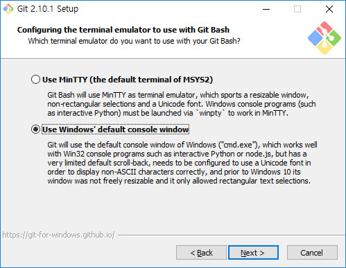

##	1. 사전 준비

node.js, grunt, git, bower, yeoman 등을 설치하고 express 프레임워크를 설치해 테스트 환경을 구축할 것입니다.

### 1.1. Node.js

웹 서버를 설치하는 방법은 여러 가지가 있지만 프론트 엔드 개발에 최적화되어있는 Node.js를 사용할 것입니다. <https://nodejs.org/ko/> 접속해 파일을 다운로드하고 설치를 진행합니다. 설치 시 별도의 설정은 필요하지 않습니다.

설치가 완료되면 명령 프롬프트를 열고 `node -version`을 입력합니다.

```bash
node --version
v6.7.0
```

설치가 정상적으로 되었다면 npm(node package manager)를 사용하여 노드 모듈을 설치해 서버 구동 환경 및 디버깅 환경을 설정할 것입니다.

### 1.2. Grunt

Grunt는 프론트 엔드 빌드 자동화 도구입니다. 파일 축소, 컴파일, 단위 테스트, 코드 스타일 검사 및 문법 오류 검사 등 반복적인 작업의 수행을 쉽게 할 수 있습니다.

**Grunt-CLI 설치**

```bash
npm install -g grunt-cli
```
Grunt 명령을 실행할 수 있도록 grunt-cli를 먼저 설치합니다. 설치 옵션으로 -g를 주는 것은 Grunt 명령을 시스템 어디에서도 실행할 수 있도록 전역 설치를 하겠다는 의미입니다.

자세한 내용은 <http://gruntjs.com/>에서 확인하세요.

### 1.3 Git 설치

Bower를 사용하기 위해서는 Node.js와 Git이 필요합니다. Git(<https://msysgit.github.io/>)에 접속해 자신의 운영체제에 맞는 프로그램을 다운로드하여 설치하며, 터미널 창에서 node.js 및 Python, Ruby와 같은 윈도우의 콘솔 프로그램을 사용하기 위해 설치 옵션 중 윈도우의 콘솔을 기본으로 사용하는 것을 체크하고 설치해야 됩니다.



> 서브라임 텍스트의 경우 현재 편집 중인 위치에서 terminal 창을 열 수 있는 플러그인(<https://packagecontrol.io/packages/Terminal>)을 사용할 수 있습니다.

### 1.4. Bower

웹 개발 시 자주 쓰이는 라이브러리를 쉽고 간편하게 관리할 수 있습니다.

** Bower 설치 **

```bash
npm install -g bower
```

** 패키지 설치 **

```bash
bower install --save jquery
```

`-- save` 옵션을 적어주면 설치한 패키지가  bower.jons 파일에 추가되며 의존성 관리를 편하게 할 수 있습니다.  이렇게 설치된 라이브러리들을 다른 프로젝트에서 동일하게 사용한다면 bower.json 파일을 복사해 bower install 명령을 실행하게 되면 bower.json에 작성되어 있는 라이브러리를 한 번에 설치할 수 있습니다.

** 패키지 검색 **

```bash
bower search greensock
```

** 패키지 버전 정보 확인 **

```bash
bower info greensock
```

> package의 특정 버전을 설치하고 싶으시면 package 명 뒤에 #버전을 사용합니다.

자세한 내용은 <https://bower.io>에서 확인하세요.

### 1.5. Yeoman

Yeoman은 angular나 express 등 관련 프레임워크에 대한 scaffolding 구조를 자동으로 생성해 별다른 설정 없이 유용한 기능을 프로젝트에 바로 사용할 수 있습니다.

> scaffolding : 애플리케이션을 만들려고 할 때 생산하는 복잡하고 많은 양의 구조와 코드를 자동으로 생성해주는 기능을 말합니다.

** Yeoman 설치 **

```bash
npm install -g yo
```

** generator 설치 **

yo를 사용해 프레임워크를 설치하려면 먼저 해당 프레임워크에 대한 generator를 설치하셔야 합니다.

```bash
npm install -g generator-webapp
```

Yeoman : <http://yeoman.io/learning/index.html>

Generator 검색 : <http://yeoman.io/generators/>

** 프레임워크 설치 **
전역으로 설치된 generator를 설치를 원하는 디렉터리로 이동해 설치하면 됩니다.

```bash
yo webapp
```

### 1.6. Express 프레임워크

Expess 프레임워크 설치는 yo을 통해 설치할 것입니다. yo로 설치를 진행하는 이유는 테스트를 위한 별도의 패키지 설치나 설정 파일을 작성하지 않고 바로 서버를 구동해 테스트를 진행할 수 있는 장점이 있습니다.

Express 더 알아보기 : <http://expressjs.com/ko/>

#### 1.6.1 express 설치

설치는 yeoman을 사용해 설치를 할 것입니다.

** express generator 설치 **

```bash
npm install -g generator-express
```

** express 설치 **

설치를 원하는 디렉터리로 이동하여 설치를 진행합니다.

```bash
yo express
```

설치 옵션 지정하는 부분이 있는데 아래와 같은 값으로 설치하시면 됩니다. express 프레임워크를 사용하여 웹 서비스를 구축하는 것이 목적이 아니라, 테스트 환경을 구축하는 것이 목적이기 설치 옵션에 대한 자세한 설명은 하지 않도록 하겠습니다.

```bash
? Select a version to install: Basic
? Select a view engine to use: EJS
? Select a css preprocessor to use (Sass Requires Ruby): None
? Select a build tool to use: Grunt
```

#### 1.6.2. 디렉토리 구조

express 설치가 완료된 후 폴더 및 파일은 다음과 같습니다. 테스트를 위해 정적 파일 위치인 public 폴더 안에 HTML, css, img, javascript 등의 파일을 구성해 작업을 진행할 것입니다.

routes, views 폴더는 express 프레임워크를 사용해 웹 서비스를 개발할 때 사용하는 route 기능과 html 뷰 템플릿 파일이 위치하며, node_modules 폴더는 npm 패키지 파일이 설치되는 위치입니다.

```bash
express/
├── bin/
│ └── www                                     // 서버 구동 파일
├── node_modules/                           // 노드 패키지 설치 디렉터리
├── public/                                      // 정적 파일 위치
├── routes/                                      // 라우트 js 파일 디렉터리
├── views/                                       // html 템플릿 파일 디렉터리
├── .bowerrc                                    // bower 설치 디렉터리
├── .editorconfig                               // 편집기 기본 설정
├── .gitignore                                   // git 제외 설정
├── app.js                                        // express 프레임워크 기본 설정
├── bower.json                                  // bower 패키지 의존성 관리
├── Gruntfile.js                                  // 빌드 및 테스트 기본 설정
└── package.json                               // npm 의존성 관리
```

#### 1.6.3. 파일 설명

** bin/www **

node 서버 구동을 위한 코드가 작성되어 있습니다. 기본 3000 포트를 사용하고 있으며, 다른 포트로 변경 가능합니다.

```js
#!/usr/bin/env node
var app = require('../app');

app.set('port', process.env.PORT || 3000);
//app.set('port', process.env.PORT || 4000);

var server = app.listen(app.get('port'), function() {
  console.log('Express server listening on port ' + server.address().port);
});
```

** bower.json **

bower로 설치한 패키지들의 의존성을 관리하는 파일입니다. express 설치 시 별도로 설치된 라이브러리는 없습니다. 추가로 필요한 라이브러리가 있다면 bower를 이용해 설치를 진행합니다.

```js
{
  "name": "express",
  "version": "0.0.1",
  "ignore": [
    "**/.*",
    "node_modules",
    "components"
  ]
}
```

** .bowerrc **

bower로 패키지를 설치할 때 설치 위치를 지정합니다. 기본 설치 디렉터리는 `public/components`입니다.

```bash
{
  "directory": "public/components",
  "json": "bower.json"
}
```

bower 설정 알아보기 : <https://github.com/bower/spec/blob/master/config.md>

> bower 설치시 패키지 별 파일 관리를 위한 [bower-installer](https://github.com/blittle/bower-installer)를 사용하셔도 됩니다.

** .gitignore **

보통 로그 파일 및 프로젝트 설정 파일 등 git이 관리할 필요가 없는 파일을 작성합니다.

.gitignore 파일 작성 예

```bash
# 확장자가 .a인 파일 무시
*.a

# 윗 라인에서 확장자가 .a인 파일은 무시하게 했지만 lib.a는 무시하지 않음
!lib.a

# 현재 디렉토리에 있는 TODO파일은 무시하고 subdir/TODO처럼 하위디렉토리에 있는 파일은 무시하지 않음
/TODO

# build/ 디렉토리에 있는 모든 파일은 무시
build/

# doc/notes.txt 파일은 무시하고 doc/server/arch.txt 파일은 무시하지 않음
doc/*.txt

# doc 디렉토리 아래의 모든 .txt 파일을 무시
doc/**/*.txt
```

.gitignore 더 알아보기 : <https://git-scm.com/book/en/v2/Git-Basics-Recording-Changes-to-the-Repository#Ignoring-Files>

 github에서 제공하는 프로젝트별 가이드 : <https://github.com/github/gitignore>

** .editorconfig **

프로젝트의 진행 시 여러 작업자가 동일한 코딩 스타일을 유지할 수 있도록 사용자의 기본 설정보다 우선하여 설정 내용이 반영됩니다.

```bash
[*]
indent_style = space
indent_size = 2
end_of_line = lf
charset = utf-8
trim_trailing_whitespace = true
insert_final_newline = true
```

*사용하는 에디터가 .editorconfig 파일을 지원해야만 사용이 가능하며, 서브라임 텍스트의 경우 플러그인을 설치해야 합니다.*

editconfig 옵션 더 알아보기 : <https://github.com/editorconfig/editorconfig/wiki/EditorConfig-Properties>

** app.js **

express 애플리케이션에 대한 환경 설정 파일입니다. 몇몇 주요 내용만 살펴보도록 하겠습니다.

- HTML 템플릿 엔진과 템플릿 파일 위치를 지정

```js
app.set('views', path.join(__dirname, 'views'));
app.set('view engine', 'ejs');
```
-	라우트 파일 지정(특정 URL로 들어오는 http request에 대한 handler)

```js
var routes = require('./routes/index');
var users = require('./routes/user');
...
app.use('/', routes);
app.use('/users', users);
```

-	정적 파일 위치 지정

```js
app.use(express.static(path.join(__dirname, 'public')));
```

여러 위치에 정적 파일을 두고 사용하려면 다음과 같이 express.static 미들웨어 함수를 여러번 호출하면 됩니다. 참고할 부분은 정적 디렉토리를 설정한 순서대로 파일을 검색합니다.

```js
app.use(express.static(path.join(__dirname, 'front-end')));
app.use(express.static(path.join(__dirname, 'admin')));
```

express 정적 파일 더 알아보기 : <http://expressjs.com/ko/starter/static-files.html>

** gruntfile.js **

gruntfile에는 테스트를 진행하기 위해 간단한 테스트 서버 구동과 파일 변경시 서버에 알림을 회신하는 두 가지 기능만 설정되어있습니다. 추가적인 작업이 필요하다면 원하는 기능의 플러그인(<http://gruntjs.com/plugins>)을 설치하고 task(<http://gruntjs.com/configuring-tasks>)를 작성해 사용하면 됩니다. 설정을 모두 확인하였다면 명령 창을 열고 'grunt'를 입력하면 웹 서버가 구동됩니다.

```bash
grunt
Running "develop:server" (develop) task

[grunt-develop] > started application "bin/www".
Running "watch" task
Waiting...

[grunt-develop] > Express server listening on port 3000
```

gruntfile 샘플 : <http://gruntjs.com/sample-gruntfile>

watch 옵션 : <https://github.com/gruntjs/grunt-contrib-watch>

** package.json **

node.js로 프로젝트를 진행하게 되면 애플리케이션의 기본 정보와 모듈의 설치 정보를 package.json으로 관리하게 됩니다. 모듈의 설치 옵션을 `--save`로 주면 dependencies에 모듈의 정보가 기록되며 `--save-dev`로 주면 devDependencies에 모듈의 정보가 기록됩니다. 다음은 generator-express로 express를 설치하게 되면 기본적으로 생성되는 package.json파일입니다.

```bash
{
  "name": "express",
  "version": "0.0.1",
  "private": true,
  "scripts": {
    "start": "node ./bin/www"
  },
  "dependencies": {
    "express": "^4.13.3",
    "serve-favicon": "^2.3.0",
    "morgan": "^1.6.1",
    "cookie-parser": "^1.3.3",
    "body-parser": "^1.13.3",
    "ejs": "^2.3.1"
  },
  "devDependencies": {
    "grunt": "^1.0.1",
    "grunt-develop": "^0.4.0",
    "grunt-contrib-watch": "^1.0.0",
    "request": "^2.60.0",
    "time-grunt": "^1.2.1",
    "load-grunt-tasks": "^3.2.0"
  }
}
```

package.json 작성 방법 : <http://programmingsummaries.tistory.com/385>

----

### 정리하며

프론트 엔드 개발의 위한 기본 설치 작업을 진행하였습니다. 각각 설치된 패키지들의 상세한 내용까지 다루지 않았지만, 프론트 엔드 개발 작업을 진행하려면 조금 더 깊이 있게 알아야 합니다. 특히 Grunt와 같은 자동화 도구의 경우는 보다 심도있게 파악해 업무의 효율성을 높여 보세요.
