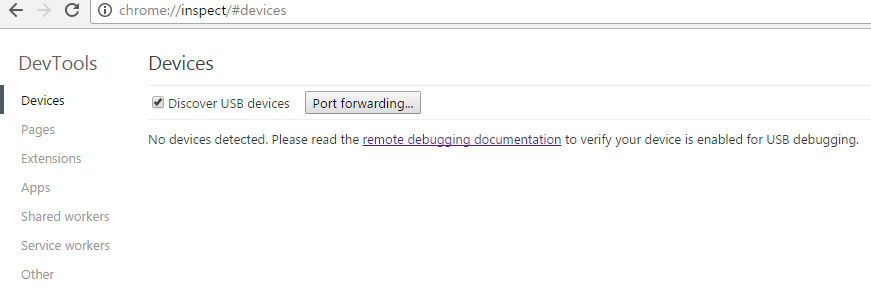
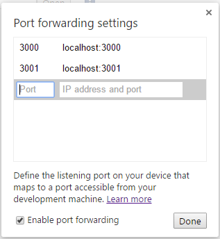

3. 모바일 웹 애플리케이션 디버깅
-----------------------------

크롬과 크롬 확장 도구인 ADB 플러그인을 이용하여 로컬에서 작업한 파일을 Andriod 디바이스에 연결해 실시간으로 확인하고 디버깅하는 방법에 대해 살펴볼 것입니다. PC 웹 애플리케이션 디버깅 방법에서 살펴본 livereload 기능도 동일하게 사용할 수 있어 모바일 웹 애플리케이션 디버깅을 보다 손쉽게 할 수 있습니다.

### 3.1. 사전 준비

Windows 개발환경에서 Android 모바일 디바이스에서 디버깅을 하기 위해 설치하고 설정해야 하는 목록은 다음과 같습니다.

1.	USB 드라이버 설치
2.	USB 디버깅 활성
3.	JDK 설치 및 환경변수 설정
4.	안드로이드 스튜디오 설치
5.	안드로이드 SDK 도구 업데이트
6.	ADB 환경변수 설정
7.	PC와 스마트폰 연결
8.  Chrome Inspect 설정

#### 3.2. USB 드라이버 설치

Windows 환경에서 개발하면서 테스트용으로 기기를 연결하고자 하는 경우, 연결하려는 디바이스에 맞는 드라이버를 설치해야 합니다.

-	**참고 자료**<br> 삼성 통합 USB 드라이버 : http://local.sec.samsung.com/comLocal/support/down/kies_main.do?kind=usb<br> 제조사별 USB 드라이버 : https://developer.android.com/studio/run/oem-usb.html

### 3.3 USB 디버깅 활성

스마트폰 설정 메뉴의 "개발자 옵션"에서 "USB 디버깅" 옵션을 선택해야지만 디바이스를 PC에 연결해 디버깅을 할 수 있습니다. 디바이스 마다 USB 디버깅 옵션을 선택하는 방법에는 차이가 있을 수 있습니다.

**갤럭시 S4 - USB 디버깅 모드 사용 방법**

1.	환경설정
2.	더보기
3.	디바이스 정보
4.	빌드번호(7회에서 9회 정도 연속으로 터치하면 개발자 옵션 활성)
5.	디바이스 정보(상위 메뉴로 이동)
6.	개발자 옵션
7.	USB 디버깅(항목 체크)

### 3.4. JDK 설치 및 환경변수 설정

JDK(Java Development Kit)는 자바 프로그램의 개발을 위한 소프트웨어와 라이브러리 모음입니다. Oracle 홈페이지(https://www.oracle.com/index.html)에 접속해 사용자의 OS 환경에 맞는 JDK를 다운로드하여 설치합니다.

JDK 설치를 완료하였다면 자바 프로그램을 시스템 어느 곳에서든 실행할 수 있도록 환경변수를 설정해 주어야 합니다. 우선 JDK 설치 경로를 복사합니다. 설치 시 디렉터리를 변경하지 않았다면 `C:\Program Files\Java\jdk1.8.0_101\bin`에 설치가 되었을 것입니다. 아래의 순서에 따라 이동하면 환경변수 편집창을 열수 있습니다.

1.	제어판
2.	시스템
3.	고급 시스템 설정
4.	환경변수
5.	시스템 변수

> 어드민 계정이 아니라면 사용자 변수의 path 항목을 편집해야 합니다.

시스템 변수의 Path 항목을 선택한 후 편집 버튼을 클릭해 시스템 변수 편집창을 열어 복사한 JDK 설치 경로를 텍스트의 끝에 붙여 넣습니다. 텍스트의 끝 문자가 세미콜론으로 끝나지 않으면 세미콜론을 작성하고 경로를 붙여 넣습니다.

```
;C:\Program Files\Java\jdk1.8.0_101\bin;
```

> 시스템 변수에서 세미콜론은 변수와 변수를 구분하는 구분자 역활을 합니다.

환경변수 설정이 잘 되었는지 확인은 명령창을 열고 "java -version"를 입력해 확인할 수 있습니다.

```
java -version
java version "1.8.0_101"
Java(TM) SE Runtime Environment (build 1.8.0_101-b13)
Java HotSpot(TM) 64-Bit Server VM (build 25.101-b13, mixed mode)
```

### 3.5. 안드로이드 스튜디오 설치

안드로이드 스튜디오를 설치해 필수 SDK 도구를 설치하고 Android SDK Manager를 통해 Google USB Driver를 설치할 것입니다. 안드로이드 스튜디오 홈페이지(https://developer.android.com/studio/index.html)에 접속해 프로그램을 다운로드하여 설치를 진행합니다.


최초 설치 후 뜨는 창으로 이전 환경설정을 사용할 것인지 확인하는 창입니다. 이전 설정이 없으므로 다음으로 넘어가시면 됩니다.

이후 SDK 설치 마법사가 진행되며 기본 값으로 설치를 진행합니다.


설치가 완료되면 Welcome to Andriod Studio 창이 나타나며 'Start a new Android Studio project'를 클릭해 신규 프로젝트를 생성합니다.

안드로이드 스튜디오 동영상 설치 가이드 : https://developer.android.com/studio/install.html

### 3.6. 안드로이드 SDK 도구 업데이트

SDK Manager 열어 Google USB Driver를 설치할 것입니다.

1.	Tool
2.	Android
3.	SDK Manager


Default Setting 창이 열리며 Android SDK 항목이 선택되어 있습니다. 우측 탭에서 SDK Tools를 클릭해 Google USB Driver를 선택하고 "OK" 버튼을 클릭해 설치를 진행합니다.


SDK Manager에 대한 자세한 정보는 https://developer.android.com/studio/intro/update.html#sdk-manager에서 확인해 보세요.

### 3.7. ADB 환경변수 설정

스마트폰을 PC에 연결하기 위해서는 ADB라는 프로그램이 사용됩니다. ADB 프로그램을 시스템 어디에서도 실행할 수 있도록 환경변수를 설정할 것입니다. 우선 ADB 설치 위치를 클립보드에 복사해 둡니다. 설치 위치는 SDK를 설치 받은 경로의 하위 "platfrom-tools" 디렉터리입니다. 안드로이드 SDK의 설치 위치를 확인 방법은 SDK Manager를 열어 확인할 수 있습니다. 아래의 순서에 따라 이동하면 환경변수 편집창을 열수 있습니다.

1.	제어판
2.	시스템
3.	고급 시스템 설정
4.	환경변수
5.	시스템 변수

시스템 변수의 Path 항목을 선택한 후 편집 버튼을 클릭해 시스템 변수 편집창을 열어 복사한 ADB 설치 경로를 텍스트의 끝에 붙여 넣습니다. 텍스트의 끝 문자가 세미콜론으로 끝나지 않으면 세미콜론을 작성하고 경로를 붙여 넣습니다.

```
;C:\Users\Administrator\AppData\Local\Android\sdk\platform-tools;
```

> 시스템 변수에서 세미콜론은 변수와 변수를 구분하는 구분자 역활을 합니다.

ADB 환경변수 설정이 완료 되었다면 명령창을 열고 "adb version"라고 입력해 봅니다.

```
adb version
Android Debug Bridge version 1.0.36
Revision e02fe72a18c3-android
```

### 3.8. PC와 스마트폰 연결

모든 설치와 설정을 완료하였다면 PC와 디바이스를 USB 케이블로 연결합니다. 크롬 브라우저를 열고 주소창에 `chrome://inspect/#devices`을 입력합니다. ADB 프로그램을 실행하지 않아 디바이스와 PC가 아직 연결되지 않은 상태입니다.



명령창을 열고 `adb devices`를 입력합니다.

```
adb devices
List of devices attached
* daemon not running. starting it now on port 5037 *
* daemon started successfully *
d3da4f2f        unauthorized
```

> adb kill-server 명령으로 adb 실행을 중지할 수 있습니다.

디바이스와 PC가 통신하게 되면 USB 디버깅 허용에 대한 알림 창이 열리게 되며 확인 버튼을 눌러 창을 닫습니다.


다시 크롬 브라우저를 확인해 보면 디바이스의 이름이 표시되며 디바이스의 크롬 브라우저에서 오픈되어 있는 화면 목록이 나타나게 됩니다. "Open tab with url" 입력창에 URL을 입력하면 연결되어있는 디바이스의 크롬 브라우저에서 해당 URL이 새창으로 열리게 됩니다.


### 3.9. Chrome Inspect 설정

사용자의 로컬 작업 파일을 모바일 크롬 브라우저에서 바로 확인할 수 있도록 PC 크롬 브라우저의 환경 설정을 진행할 것입니다.

PC 크롬 브라우저의 주소창에 `chrome://inspect/#devices`를 입력해 DevTools 페이지에 접속합니다. "Port forwarding..." 버튼을 클릭하면 "Port forwarding settings" 팝업창이 오픈되며 이곳에 로컬 웹서의 포트 정보를 입력해 주면 됩니다. gruntfile.js에서 설정한 웹 서버는 포트 3000번을 작성하고, 브라우저 자동 갱신 기능도 사용할 것이므로 livereload 서버 포트 3001번도 작성해 줍니다.



gruntfile.js의 livereload 포트는 기본값이 35729번 입니다. 하지만 Port forwarding settings에서 5자리 포트 번호를 입력하면 에러가 나는 현상이 발생해 livereload 포트 번호를 3001번으로 수정해 주어야 합니다.

```
  var reloadPort = 3001, files;
```

명령 창에 `grunt`를 실행해 로컬 웹 서버를 구동하고, PC 크롬 브라우저의 `chrome://inspect/#devices`로 접속해 "Open tab with url" 입력창에 작업 중인 페이지 URL을 입력합니다. 모바일 디바이스에 크롬 브라우저를 열어 놓으셨다면 입력한 페이지가 오픈되는 것을 확인할 수 있을 것입니다. 해당 페이지를 편집기에서 열어 수정하고 저장하면 변경된 내용이 바로 적용되는 모습을 확인할 수 있습니다.


모바일 크롬 브라우저의 오픈되어 있는 화면 목록 URL 아래 "inspect" 링크를 클릭하면 "Developer Tools" 창이 열리며 "Elements" 탭의 HTML 요소를 클릭하면 모바일 디바이스에 해당 요소가 선택됩니다.

### 정리하며

모바일 작업을 진행하다 보면 실제 디바이스에 연결해 확인하는 작업이 번거로워 PC 브라우저를 통해 확인을하게 됩니다. 하지만 어떠한 요소들은 실제 디바이스에서만 확인을 해야하는 경우가 반드시 있습니다. 이제 부터 손쉽게 모바일 디바이스에서 작업물을 확인해 보며 보다 명확하게 작업을 진행함으로 수정에 대한 리스크 요소를 줄일 수 있을 것입니다.
